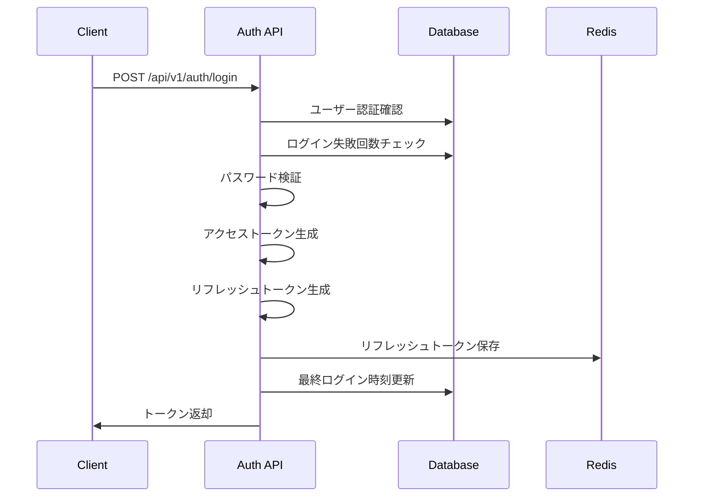
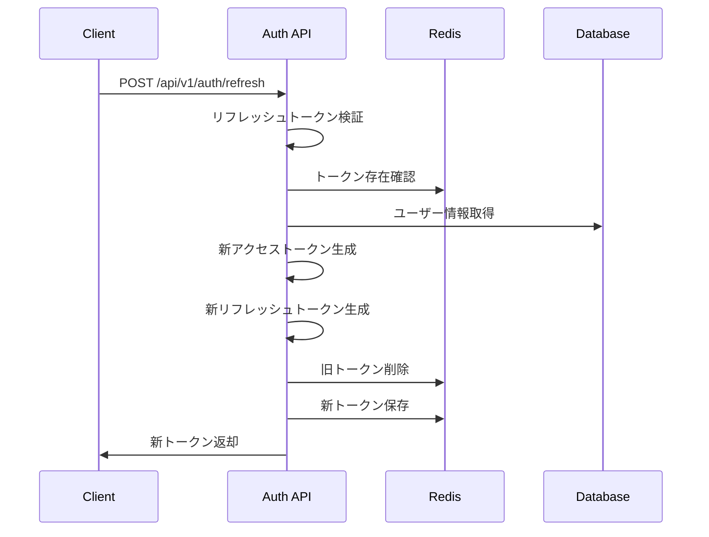
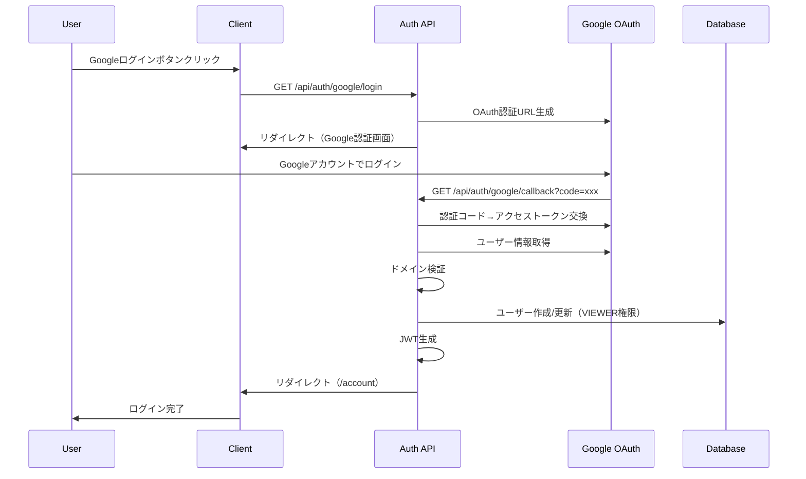
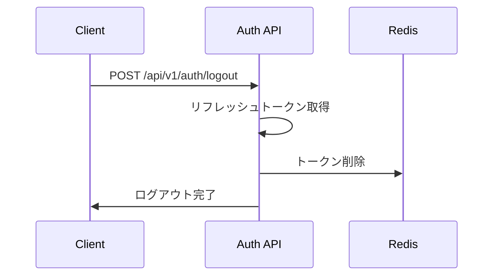
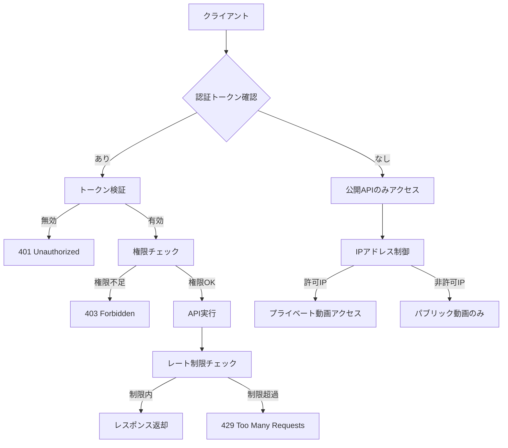

# 認証設計書

## 1. 認証設計方針

### 1.1 基本原則
- **JWT（JSON Web Token）**ベースの認証
- **ステートレス**な認証システム
- **セキュリティ**重視（パスワードポリシー、ログイン失敗制御）
- **管理者・投稿者のみ**の限定的ユーザー（視聴者は匿名）
- **セッション管理**の併用（リフレッシュトークン用）

### 1.2 認証対象ユーザー
```
視聴者: パスワード認証 または Google OAuth認証
管理者: パスワード認証（手動作成）
投稿者: パスワード認証（手動作成）
```

**注意**: v1.3アップデートにより、視聴者も認証が必要になりました。Google OAuth認証の追加により、組織のGoogleアカウントでのログインが可能です。

### 1.3 トークン構成
- **アクセストークン**: 24時間有効期限（実装版）
- **リフレッシュトークン**: 7日有効期限（長期）
- **CSRF保護**: ダブルサブミットクッキー

## 2. JWT設計

### 2.1 アクセストークン構造
```json
{
  "header": {
    "alg": "HS256",
    "typ": "JWT"
  },
  "payload": {
    "sub": "1",
    "username": "admin",
    "role": "admin",
    "iat": 1717401600,
    "exp": 1717402500,
    "iss": "video-platform",
    "aud": "video-platform-users"
  },
  "signature": "HMACSHA256(base64UrlEncode(header) + '.' + base64UrlEncode(payload), secret)"
}
```

### 2.2 リフレッシュトークン構造
```json
{
  "header": {
    "alg": "HS256",
    "typ": "JWT"
  },
  "payload": {
    "sub": "1",
    "type": "refresh",
    "iat": 1717401600,
    "exp": 1718006400,
    "jti": "refresh_token_id_123",
    "iss": "video-platform"
  }
}
```

### 2.3 JWT Payload詳細

| フィールド | 説明 | 例 |
|-----------|------|---|
| sub | ユーザーID | "1" |
| username | ユーザー名 | "admin" |
| role | ユーザー権限 | "admin", "curator" |
| iat | 発行時刻 | 1717401600 |
| exp | 有効期限 | 1717402500 |
| iss | 発行者 | "video-platform" |
| aud | 対象者 | "video-platform-users" |
| jti | トークンID | "refresh_token_id_123" |

## 3. 認証フロー

### 3.1 ログインフロー


### 3.2 トークンリフレッシュフロー


### 3.3 Google OAuth認証フロー（新規追加 v1.3）


### 3.4 ログアウトフロー


## 4. 認証ミドルウェア

### 4.1 JWT検証ミドルウェア
```typescript
interface AuthMiddleware {
  verifyToken(token: string): Promise<JWTPayload>;
  checkPermission(role: string, requiredRole: string[]): boolean;
  handleTokenExpiry(token: string): Promise<RefreshResult>;
}

// 実装例
export const authMiddleware = async (req: Request, res: Response, next: NextFunction) => {
  try {
    const authHeader = req.headers.authorization;
    if (!authHeader?.startsWith('Bearer ')) {
      return res.status(401).json({ error: 'AUTH_REQUIRED' });
    }

    const token = authHeader.substring(7);
    const payload = await verifyAccessToken(token);
    
    req.user = {
      id: payload.sub,
      username: payload.username,
      role: payload.role
    };
    
    next();
  } catch (error) {
    if (error.name === 'TokenExpiredError') {
      return res.status(401).json({ error: 'TOKEN_EXPIRED' });
    }
    return res.status(401).json({ error: 'INVALID_TOKEN' });
  }
};
```

### 4.2 権限チェックミドルウェア
```typescript
export const requireRole = (roles: string[]) => {
  return (req: Request, res: Response, next: NextFunction) => {
    if (!req.user) {
      return res.status(401).json({ error: 'AUTH_REQUIRED' });
    }
    
    if (!roles.includes(req.user.role)) {
      return res.status(403).json({ error: 'INSUFFICIENT_PERMISSIONS' });
    }
    
    next();
  };
};

// 使用例
app.get('/api/v1/admin/users', authMiddleware, requireRole(['admin']), getUserList);
app.post('/api/v1/videos', authMiddleware, requireRole(['admin', 'curator']), createVideo);
```

## 5. パスワード管理

### 5.1 パスワードポリシー
```typescript
interface PasswordPolicy {
  minLength: 12;
  requireUppercase: true;
  requireLowercase: true;
  requireNumbers: true;
  requireSymbols: true;
  prohibitCommonPasswords: true;
  prohibitUserInfo: true; // ユーザー名、メールアドレスを含まない
}

export const validatePassword = (password: string, user: User): ValidationResult => {
  const policy = getPasswordPolicy();
  const errors: string[] = [];

  if (password.length < policy.minLength) {
    errors.push(`パスワードは${policy.minLength}文字以上である必要があります`);
  }

  if (!/[A-Z]/.test(password)) {
    errors.push('大文字を含む必要があります');
  }

  if (!/[a-z]/.test(password)) {
    errors.push('小文字を含む必要があります');
  }

  if (!/[0-9]/.test(password)) {
    errors.push('数字を含む必要があります');
  }

  if (!/[!@#$%^&*(),.?":{}|<>]/.test(password)) {
    errors.push('記号を含む必要があります');
  }

  // ユーザー情報のチェック
  const userInfo = [user.username, user.email.split('@')[0]];
  if (userInfo.some(info => password.toLowerCase().includes(info.toLowerCase()))) {
    errors.push('ユーザー名やメールアドレスを含むことはできません');
  }

  return {
    isValid: errors.length === 0,
    errors
  };
};
```

### 5.2 パスワードハッシュ化
```typescript
import bcrypt from 'bcrypt';

const SALT_ROUNDS = 12;

export const hashPassword = async (password: string): Promise<string> => {
  return await bcrypt.hash(password, SALT_ROUNDS);
};

export const verifyPassword = async (password: string, hash: string): Promise<boolean> => {
  return await bcrypt.compare(password, hash);
};
```

## 6. ログイン失敗制御

### 6.1 アカウントロック機能
```typescript
interface LoginAttemptConfig {
  maxAttempts: 10; // 最大試行回数
  lockoutDuration: 30 * 60 * 1000; // 30分のロックアウト
  attemptWindow: 15 * 60 * 1000; // 15分の監視ウィンドウ
}

export const checkLoginAttempts = async (username: string): Promise<LoginCheckResult> => {
  const user = await getUserByUsername(username);
  if (!user) {
    return { allowed: false, reason: 'USER_NOT_FOUND' };
  }

  const config = getLoginAttemptConfig();
  const now = new Date();

  // アカウントが無効化されている場合
  if (!user.is_active) {
    return { allowed: false, reason: 'ACCOUNT_DISABLED' };
  }

  // ロックアウト期間中かチェック
  if (user.last_failed_login_at) {
    const lockoutEnd = new Date(user.last_failed_login_at.getTime() + config.lockoutDuration);
    if (user.failed_login_count >= config.maxAttempts && now < lockoutEnd) {
      return { 
        allowed: false, 
        reason: 'ACCOUNT_LOCKED',
        lockoutEnd
      };
    }
  }

  return { allowed: true };
};

export const recordLoginAttempt = async (username: string, success: boolean): Promise<void> => {
  const user = await getUserByUsername(username);
  if (!user) return;

  if (success) {
    // ログイン成功時：失敗カウントをリセット
    await updateUser(user.id, {
      failed_login_count: 0,
      last_failed_login_at: null,
      last_login_at: new Date()
    });
  } else {
    // ログイン失敗時：失敗カウントを増加
    await updateUser(user.id, {
      failed_login_count: user.failed_login_count + 1,
      last_failed_login_at: new Date()
    });
  }
};
```

## 7. セッション管理

### 7.1 Redis セッションストア
```typescript
import Redis from 'ioredis';

const redis = new Redis({
  host: process.env.REDIS_HOST,
  port: parseInt(process.env.REDIS_PORT || '6379'),
  password: process.env.REDIS_PASSWORD,
});

export class SessionStore {
  // リフレッシュトークン保存
  async saveRefreshToken(userId: string, tokenId: string, expiresAt: Date): Promise<void> {
    const key = `refresh_token:${userId}:${tokenId}`;
    const ttl = Math.floor((expiresAt.getTime() - Date.now()) / 1000);
    
    await redis.setex(key, ttl, JSON.stringify({
      userId,
      tokenId,
      createdAt: new Date().toISOString()
    }));
  }

  // リフレッシュトークン確認
  async validateRefreshToken(userId: string, tokenId: string): Promise<boolean> {
    const key = `refresh_token:${userId}:${tokenId}`;
    const exists = await redis.exists(key);
    return exists === 1;
  }

  // リフレッシュトークン削除
  async removeRefreshToken(userId: string, tokenId: string): Promise<void> {
    const key = `refresh_token:${userId}:${tokenId}`;
    await redis.del(key);
  }

  // ユーザーの全セッション削除
  async removeAllUserSessions(userId: string): Promise<void> {
    const pattern = `refresh_token:${userId}:*`;
    const keys = await redis.keys(pattern);
    if (keys.length > 0) {
      await redis.del(...keys);
    }
  }
}
```

## 8. CSRF保護

### 8.1 ダブルサブミットクッキー
```typescript
import crypto from 'crypto';

export const generateCSRFToken = (): string => {
  return crypto.randomBytes(32).toString('hex');
};

export const csrfProtection = (req: Request, res: Response, next: NextFunction) => {
  // GET リクエストは除外
  if (req.method === 'GET') {
    return next();
  }

  const tokenFromHeader = req.headers['x-csrf-token'] as string;
  const tokenFromCookie = req.cookies['csrf-token'];

  if (!tokenFromHeader || !tokenFromCookie || tokenFromHeader !== tokenFromCookie) {
    return res.status(403).json({ error: 'CSRF_TOKEN_MISMATCH' });
  }

  next();
};

// トークン設定
export const setCSRFToken = (res: Response): string => {
  const token = generateCSRFToken();
  res.cookie('csrf-token', token, {
    httpOnly: false, // JavaScriptからアクセス可能
    secure: process.env.NODE_ENV === 'production',
    sameSite: 'strict',
    maxAge: 24 * 60 * 60 * 1000 // 24時間
  });
  return token;
};
```

## 9. 認証API実装

### 9.1 ログインAPI
```typescript
export const loginHandler = async (req: Request, res: Response) => {
  try {
    const { username, password } = req.body;

    // 入力検証
    if (!username || !password) {
      return res.status(400).json({
        success: false,
        error: { code: 'VALIDATION_ERROR', message: 'ユーザー名とパスワードが必要です' }
      });
    }

    // ログイン試行チェック
    const loginCheck = await checkLoginAttempts(username);
    if (!loginCheck.allowed) {
      await recordLoginAttempt(username, false);
      return res.status(423).json({
        success: false,
        error: { 
          code: loginCheck.reason,
          message: getLoginErrorMessage(loginCheck.reason),
          lockoutEnd: loginCheck.lockoutEnd
        }
      });
    }

    // ユーザー認証
    const user = await authenticateUser(username, password);
    if (!user) {
      await recordLoginAttempt(username, false);
      return res.status(401).json({
        success: false,
        error: { code: 'INVALID_CREDENTIALS', message: 'ユーザー名またはパスワードが間違っています' }
      });
    }

    // トークン生成
    const accessToken = generateAccessToken(user);
    const refreshToken = generateRefreshToken(user);

    // セッション保存
    await sessionStore.saveRefreshToken(user.id.toString(), refreshToken.jti, new Date(refreshToken.exp * 1000));

    // ログイン成功記録
    await recordLoginAttempt(username, true);

    // CSRFトークン設定
    const csrfToken = setCSRFToken(res);

    res.json({
      success: true,
      data: {
        access_token: accessToken.token,
        refresh_token: refreshToken.token,
        csrf_token: csrfToken,
        user: {
          id: user.id,
          username: user.username,
          display_name: user.display_name,
          email: user.email,
          role: user.role,
          department: user.department,
          profile_image_url: user.profile_image_url
        },
        expires_at: new Date(accessToken.exp * 1000).toISOString()
      }
    });

  } catch (error) {
    console.error('Login error:', error);
    res.status(500).json({
      success: false,
      error: { code: 'INTERNAL_SERVER_ERROR', message: 'ログイン処理中にエラーが発生しました' }
    });
  }
};
```

### 9.2 トークンリフレッシュAPI
```typescript
export const refreshHandler = async (req: Request, res: Response) => {
  try {
    const { refresh_token } = req.body;

    if (!refresh_token) {
      return res.status(400).json({
        success: false,
        error: { code: 'VALIDATION_ERROR', message: 'リフレッシュトークンが必要です' }
      });
    }

    // リフレッシュトークン検証
    const payload = verifyRefreshToken(refresh_token);
    
    // セッション確認
    const isValid = await sessionStore.validateRefreshToken(payload.sub, payload.jti);
    if (!isValid) {
      return res.status(401).json({
        success: false,
        error: { code: 'INVALID_REFRESH_TOKEN', message: 'リフレッシュトークンが無効です' }
      });
    }

    // ユーザー情報取得
    const user = await getUserById(payload.sub);
    if (!user || !user.is_active) {
      return res.status(401).json({
        success: false,
        error: { code: 'USER_INACTIVE', message: 'ユーザーアカウントが無効です' }
      });
    }

    // 新しいトークン生成
    const newAccessToken = generateAccessToken(user);
    const newRefreshToken = generateRefreshToken(user);

    // セッション更新
    await sessionStore.removeRefreshToken(payload.sub, payload.jti);
    await sessionStore.saveRefreshToken(user.id.toString(), newRefreshToken.jti, new Date(newRefreshToken.exp * 1000));

    res.json({
      success: true,
      data: {
        access_token: newAccessToken.token,
        refresh_token: newRefreshToken.token,
        expires_at: new Date(newAccessToken.exp * 1000).toISOString()
      }
    });

  } catch (error) {
    console.error('Refresh error:', error);
    res.status(401).json({
      success: false,
      error: { code: 'INVALID_REFRESH_TOKEN', message: 'リフレッシュトークンが無効です' }
    });
  }
};
```

### 9.3 ログアウトAPI
```typescript
export const logoutHandler = async (req: Request, res: Response) => {
  try {
    const { refresh_token } = req.body;

    if (refresh_token) {
      const payload = verifyRefreshToken(refresh_token);
      await sessionStore.removeRefreshToken(payload.sub, payload.jti);
    }

    // CSRFトークンクリア
    res.clearCookie('csrf-token');

    res.json({
      success: true,
      message: 'ログアウトしました'
    });

  } catch (error) {
    // エラーが発生してもログアウトは成功扱い
    res.json({
      success: true,
      message: 'ログアウトしました'
    });
  }
};
```

## 10. フロントエンド認証フック

### 10.1 認証コンテキスト
```typescript
interface AuthContextType {
  user: User | null;
  login: (username: string, password: string) => Promise<void>;
  logout: () => Promise<void>;
  refreshToken: () => Promise<void>;
  isLoading: boolean;
  isAuthenticated: boolean;
}

export const AuthProvider: React.FC<{ children: React.ReactNode }> = ({ children }) => {
  const [user, setUser] = useState<User | null>(null);
  const [isLoading, setIsLoading] = useState(true);

  // 自動トークンリフレッシュ
  useEffect(() => {
    const interval = setInterval(async () => {
      if (user) {
        try {
          await refreshToken();
        } catch (error) {
          await logout();
        }
      }
    }, 14 * 60 * 1000); // 14分ごと

    return () => clearInterval(interval);
  }, [user]);

  const login = async (username: string, password: string) => {
    const response = await fetch('/api/v1/auth/login', {
      method: 'POST',
      headers: { 'Content-Type': 'application/json' },
      body: JSON.stringify({ username, password })
    });

    if (response.ok) {
      const data = await response.json();
      setUser(data.data.user);
      localStorage.setItem('access_token', data.data.access_token);
      localStorage.setItem('refresh_token', data.data.refresh_token);
    } else {
      throw new Error('Login failed');
    }
  };

  return (
    <AuthContext.Provider value={{ user, login, logout, refreshToken, isLoading, isAuthenticated: !!user }}>
      {children}
    </AuthContext.Provider>
  );
};
```

## 11. セキュリティ考慮事項

### 11.1 トークンセキュリティ
- **短い有効期限**: アクセストークン15分で漏洩リスク軽減
- **安全な保存**: リフレッシュトークンはhttpOnlyクッキー推奨
- **ローテーション**: リフレッシュ時に新トークン発行

### 11.2 通信セキュリティ
- **HTTPS強制**: 本番環境ではHTTPS必須
- **HSTS**: HTTP Strict Transport Security設定
- **セキュアクッキー**: Secure, SameSite属性設定

### 11.3 監査ログ
```typescript
export const auditLogger = {
  logLogin: (username: string, success: boolean, ip: string) => {
    console.log({
      event: 'login_attempt',
      username,
      success,
      ip,
      timestamp: new Date().toISOString()
    });
  },

  logTokenRefresh: (userId: string, ip: string) => {
    console.log({
      event: 'token_refresh',
      userId,
      ip,
      timestamp: new Date().toISOString()
    });
  }
};
```

## 12. API認証・認可システム

### 12.1 APIエンドポイント分類

#### **公開API（認証不要）**
```
GET /api/videos                    # 動画一覧（パブリック動画のみ）
GET /api/posts/[post_id]          # 投稿詳細（パブリック投稿のみ）
GET /api/settings/public           # 公開設定
GET /api/categories               # カテゴリ一覧
GET /api/tags                     # タグ一覧
GET /api/videos/[...path]         # 動画ファイル配信
GET /api/playlists                # プレイリスト一覧（公開のみ）
```

#### **認証必須API（管理者・キュレーター）**
```
POST /api/upload                  # 動画アップロード
GET /api/auth/me                  # ユーザー情報取得
POST /api/auth/login              # ログイン
POST /api/auth/logout             # ログアウト
GET /api/user/profile             # プロフィール取得・更新
POST /api/user/avatar             # アバターアップロード
GET /api/playlists/[id]          # プレイリスト詳細・編集
POST /api/playlists               # プレイリスト作成
```

#### **管理者専用API**
```
GET /api/admin/*                  # 全管理機能
POST /api/admin/settings/*        # システム設定
GET /api/admin/users/*            # ユーザー管理
GET /api/admin/videos/*           # 動画管理
GET /api/admin/categories/*       # カテゴリ管理
GET /api/admin/stats              # 統計情報
GET /api/admin/deleted-files      # 削除済みファイル
```

### 12.2 権限レベル詳細

```typescript
// 権限レベル定義
enum UserRole {
  ADMIN = 'ADMIN',      // 管理者：全機能アクセス可能
  CURATOR = 'CURATOR',  // キュレーター：動画投稿・編集機能のみ
  ANONYMOUS = 'ANONYMOUS' // 匿名：視聴のみ（認証不要）
}

// 権限チェック関数
export async function authenticateApiRequest(
  request: NextRequest, 
  requiredRoles: string[] = ['ADMIN', 'CURATOR']
) {
  const token = request.cookies.get('auth-token')?.value
  
  if (!token) {
    return {
      error: NextResponse.json(
        { success: false, error: '認証が必要です' },
        { status: 401 }
      ),
      user: null
    }
  }

  try {
    const currentUser = verifyToken(token)
    
    if (!currentUser) {
      return {
        error: NextResponse.json(
          { success: false, error: '無効な認証トークンです' },
          { status: 401 }
        ),
        user: null
      }
    }

    if (!requiredRoles.includes(currentUser.role)) {
      const roleNames = requiredRoles.includes('ADMIN') && requiredRoles.includes('CURATOR') 
        ? '管理者またはキュレーター権限'
        : requiredRoles.includes('ADMIN') 
          ? '管理者権限'
          : 'キュレーター権限'
      
      return {
        error: NextResponse.json(
          { success: false, error: `${roleNames}が必要です` },
          { status: 403 }
        ),
        user: null
      }
    }

    return {
      error: null,
      user: currentUser
    }
  } catch (error) {
    return {
      error: NextResponse.json(
        { success: false, error: '認証エラーが発生しました' },
        { status: 401 }
      ),
      user: null
    }
  }
}
```

### 12.3 セキュリティ機能

#### **レート制限**
```typescript
// レート制限設定
const defaultConfig: RateLimitConfig = {
  windowMs: 15 * 60 * 1000, // 15分
  maxRequests: 100, // 100リクエスト
  keyGenerator: (request: NextRequest) => {
    // IPアドレスベースのキー生成
    const ip = request.headers.get('x-forwarded-for') || 
               request.headers.get('x-real-ip') || 'unknown'
    return `rate_limit:${ip}`
  }
}

// レート制限ミドルウェア
export function withRateLimit(
  handler: (request: NextRequest) => Promise<Response>,
  config?: Partial<RateLimitConfig>
) {
  return async (request: NextRequest): Promise<Response> => {
    const rateLimitResult = checkRateLimit(request, config)
    
    if (!rateLimitResult.allowed) {
      return new Response(
        JSON.stringify({
          success: false,
          error: 'レート制限に達しました。しばらく待ってから再試行してください。'
        }),
        {
          status: 429,
          headers: {
            'Content-Type': 'application/json',
            'X-RateLimit-Limit': config?.maxRequests?.toString() || '100',
            'X-RateLimit-Remaining': rateLimitResult.remaining.toString(),
            'X-RateLimit-Reset': rateLimitResult.resetTime.toString()
          }
        }
      )
    }
    
    return await handler(request)
  }
}
```

#### **IPアドレス制御**
```typescript
// プライベート動画のアクセス権限チェック
export async function checkPrivateVideoAccess(request: NextRequest): Promise<boolean> {
  try {
    const clientIP = getClientIP(request);
    
    // システム設定から許可IPレンジを取得
    const setting = await prisma.systemSetting.findUnique({
      where: { settingKey: 'private_video_allowed_ips' }
    });
    
    if (!setting?.settingValue) {
      return false;
    }
    
    const allowedRanges: string[] = JSON.parse(setting.settingValue);
    
    // 各IPレンジをチェック
    for (const range of allowedRanges) {
      if (isIPInRange(clientIP, range)) {
        return true;
      }
    }
    
    return false;
  } catch (error) {
    console.error('Private video access check error:', error);
    return false;
  }
}

// IPアドレス取得関数
export function getClientIP(request: NextRequest): string {
  const forwarded = request.headers.get('x-forwarded-for');
  const realIP = request.headers.get('x-real-ip');
  
  if (forwarded) {
    return forwarded.split(',')[0].trim();
  }
  
  if (realIP) {
    return realIP;
  }
  
  return request.headers.get('remote-addr') || '127.0.0.1';
}
```

### 12.4 認証フロー詳細



### 12.5 実装例

#### **動画一覧API（段階的認証）**
```typescript
export async function GET(request: NextRequest) {
  try {
    const { searchParams } = new URL(request.url)
    const includePrivate = searchParams.get('includePrivate') === 'true'
    
    let currentUser = null;

    // 管理者用機能（非公開動画を含める）の場合は権限チェック
    if (includePrivate) {
      const token = request.cookies.get('auth-token')?.value;
      if (!token) {
        return createAuthErrorResponse();
      }

      const decoded = verifyToken(token);
      if (!decoded) {
        return createAuthErrorResponse();
      }

      const user = await prisma.user.findUnique({
        where: { id: parseInt(decoded.userId) },
        select: { id: true, role: true }
      });

      if (!user || !['ADMIN', 'CURATOR'].includes(user.role)) {
        return createPermissionErrorResponse();
      }

      currentUser = user;
    }

    // 投稿者権限による制限：CURATORは自分の動画のみ表示
    if (currentUser && currentUser.role === 'CURATOR') {
      where.uploaderId = currentUser.id;
    }

    // 一般ユーザー向け：IPアドレス制御を事前チェック
    if (!includePrivate) {
      const hasPrivateAccess = await checkPrivateVideoAccess(request);
      
      if (hasPrivateAccess) {
        // プライベート動画アクセス権限がある場合
        where.posts = {
          some: {
            visibility: {
              in: ['PUBLIC', 'PRIVATE']
            }
          }
        }
      } else {
        // プライベート動画アクセス権限がない場合
        where.posts = {
          some: {
            visibility: 'PUBLIC'
          }
        }
      }
    }

    // 動画データ取得とレスポンス返却
    const videos = await prisma.video.findMany({
      where,
      include: { /* 関連データ */ },
      skip,
      take: limit,
      orderBy: { [sortBy]: sortOrder }
    });

    return createSuccessResponse(videos);
  } catch (error) {
    return createErrorResponse('動画の取得に失敗しました', 500);
  }
}
```

#### **アップロードAPI（認証必須）**
```typescript
export async function POST(request: NextRequest) {
  try {
    // 認証チェック
    const authResult = await authenticateApiRequest(request, ['ADMIN', 'CURATOR']);
    if (authResult.error) {
      return authResult.error;
    }

    const payload = { userId: authResult.user!.userId };
    
    // ファイルアップロード処理
    const formData = await request.formData();
    const file = formData.get('file') as File;
    
    if (!file) {
      return NextResponse.json(
        { success: false, error: '動画ファイルが必要です' },
        { status: 400 }
      );
    }

    // ファイル処理とデータベース保存
    const uploadedFile = await handleFileUpload(file, payload.userId);
    
    return createSuccessResponse({ video: uploadedFile });
  } catch (error) {
    return createErrorResponse('アップロードに失敗しました', 500);
  }
}
```

### 12.6 エラーレスポンス形式

#### **認証エラー**
```json
{
  "success": false,
  "error": "認証が必要です",
  "status": 401
}
```

#### **権限エラー**
```json
{
  "success": false,
  "error": "管理者またはキュレーター権限が必要です",
  "status": 403
}
```

#### **レート制限エラー**
```json
{
  "success": false,
  "error": "レート制限に達しました。しばらく待ってから再試行してください。",
  "status": 429,
  "headers": {
    "X-RateLimit-Limit": "100",
    "X-RateLimit-Remaining": "0",
    "X-RateLimit-Reset": "1717402500"
  }
}
```

### 12.7 セキュリティヘッダー

```typescript
// Content Security Policy
const cspHeaders = {
  'Content-Security-Policy': process.env.NODE_ENV === 'development' 
    ? "default-src 'self'; script-src 'self' 'unsafe-eval' 'unsafe-inline' https://www.youtube.com https://www.google.com; style-src 'self' 'unsafe-inline'; img-src 'self' data: https:; font-src 'self' data: https:; frame-src 'self' https://www.youtube.com https://www.youtube-nocookie.com; connect-src 'self' https:;"
    : "default-src 'self'; script-src 'self' 'unsafe-inline' https://www.youtube.com https://www.google.com; style-src 'self' 'unsafe-inline'; img-src 'self' data: https:; font-src 'self' data: https:; frame-src 'self' https://www.youtube.com https://www.youtube-nocookie.com; connect-src 'self' https:;"
};

// セキュリティヘッダー設定
export const securityHeaders = {
  'X-Content-Type-Options': 'nosniff',
  'X-Frame-Options': 'DENY',
  'X-XSS-Protection': '1; mode=block',
  'Referrer-Policy': 'strict-origin-when-cross-origin',
  'Permissions-Policy': 'camera=(), microphone=(), geolocation=()'
};
```

### 12.8 監査ログ

```typescript
// APIアクセス監査ログ
export const apiAuditLogger = {
  logApiAccess: (request: NextRequest, response: Response, user?: any) => {
    const clientIP = getClientIP(request);
    const userAgent = request.headers.get('user-agent') || 'unknown';
    const method = request.method;
    const url = request.url;
    const statusCode = response.status;
    
    console.log({
      event: 'api_access',
      timestamp: new Date().toISOString(),
      clientIP,
      userAgent,
      method,
      url,
      statusCode,
      userId: user?.userId || 'anonymous',
      userRole: user?.role || 'anonymous'
    });
  },

  logAuthFailure: (request: NextRequest, reason: string) => {
    const clientIP = getClientIP(request);
    
    console.log({
      event: 'auth_failure',
      timestamp: new Date().toISOString(),
      clientIP,
      reason,
      url: request.url
    });
  }
};
```

---

## 更新履歴

### v1.3 (2025年7月22日)
- **Google OAuth認証機能追加**
  - Google Workspace アカウントでのログイン対応
  - 組織ドメイン制限機能
  - デュアル認証システム（パスワード + OAuth）
  - VIEWER権限での自動ユーザー作成

### v1.2 (2025年7月15日)
- API認証・認可システム詳細追加

### v1.1 (2025年6月3日)
- 初期版作成

---
**設計版数**: 1.3  
**作成日**: 2025年6月3日  
**更新日**: 2025年7月22日  
**更新内容**: Google OAuth認証システム追加